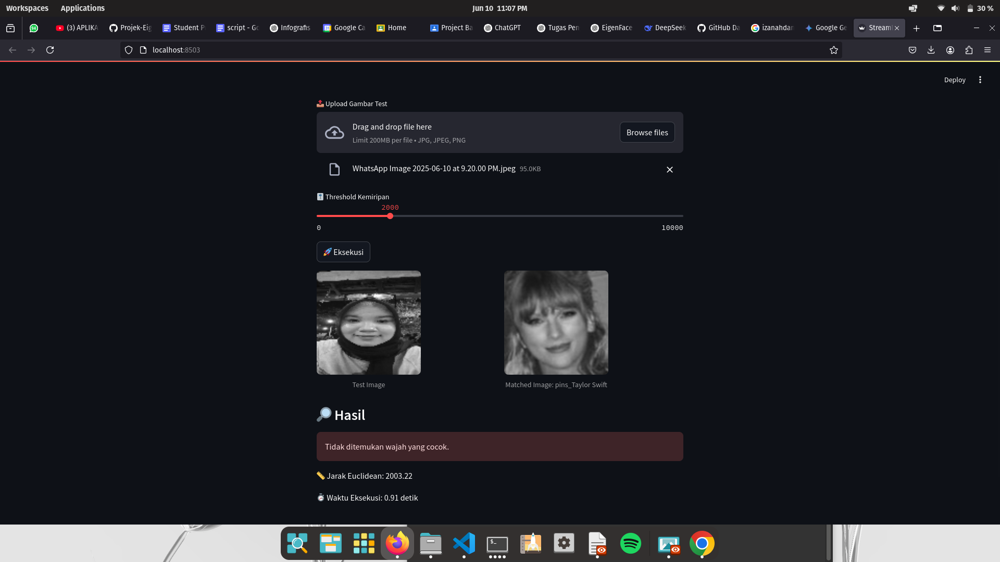

## Kelompok 
- Marleyn Laura OVT (L0124023)
- Nasywa Rifqia R (L0124027)
- Wan Nayyara Y (L0124033)
- Agischa Nur A (L0124035)

# Aplikasi Pengenalan Wajah dengan EigenFace

Aplikasi ini bertujuan untuk mengenali wajah dari gambar uji berdasarkan dataset wajah yang dimasukkan. Aplikasi menggunakan metode **EigenFace** untuk proyeksi ke ruang eigen dan menghitung jarak kemiripan menggunakan **Euclidean distance**.

---

## Demo



---

## Tujuan Program
- Mengenali wajah dari gambar uji berdasarkan dataset wajah yang dimasukkan
- Menggunakan metode EigenFace untuk proyeksi ke ruang eigen
- Menampilkan wajah paling mirip berdasarkan jarak Euclidean

---

##  Fitur

- Upload gambar wajah secara langsung untuk diuji
- Proyeksi gambar ke ruang eigen menggunakan metode PCA
- Komputasi eigenface dari dataset wajah
- Pencocokan wajah dengan dataset menggunakan jarak Euclidean
- Tampilan web interaktif dengan Streamlit
- Threshold slider untuk mengatur sensitivitas pencocokan wajah

---

## Teknologi yang Digunakan

- Python
- Streamlit (untuk GUI berbasis web)
- NumPy
- OpenCV (untuk pengolahan gambar)
- PIL / Pillow (untuk konversi gambar)
- Power Iteration (manual, untuk mencari eigenvector)

---

## Struktur Dataset

Struktur folder dataset yang digunakan:
dataset/
└── train/
    ├── pins_NamaArtis1/
    │   ├── artis1_1.jpg
    │   ├── artis1_2.jpg
    ├── pins_NamaArtis2/
    │   ├── artis2_1.jpg
    └── ...

> Folder `pins_NamaArtis` akan diubah otomatis menjadi label wajah: `NamaArtis`.

---

## Struktur Proyek
eigenface_app/
├── dataset/
│   └── train/...
├── doc/
│   ├── Readme.md
│   └── Laporan.pdf
│   └── screenshot.png
├── app.py
├── main.py
├── eigenface_streamlit_app.py

---

## Cara Menjalankan Program

1. Buka terminal di folder `eigenface_project`
2. Install library yang diperlukan:

```bash
pip install streamlit
pip install opencv-python
pip install numpy
pip install Pillow
```

3. Jalankan aplikasi

```bash
streamlit run eigenface_streamlit_app.py
```

---

## Cara Menggunakan Aplikasi

- **Upload Dataset**  
  Tekan tombol "Choose Folder Zip", pilih dataset.zip berisi wajah yang dilabeli sesuai format
- **Upload Gambar Uji**  
  Tekan "Choose Test Image", pilih gambar wajah untuk diuji
- **Atur Threshold**  
  Gunakan slider di sidebar kiri untuk mengatur threshold (default: 10000)
- **Lihat Hasil**  
  Kolom kiri: Gambar uji  
  Kolom kanan: Wajah paling mirip dari dataset  
  Di bawah: Status Match / No Match + Nilai jarak Euclidean
- **Eksekusi Selesai**  
  Ditampilkan waktu eksekusi dalam detik

---

## Penjelasan Metode (EigenFace)

- Dataset diubah ke grayscale 100×100 dan diflatten jadi vektor 1D
- Hitung wajah rata-rata (mean_face)
- Bentuk matriks deviasi A = X - mean_face
- Hitung matriks kovarian C = A.T @ A
- Cari eigenvector dominan dengan metode Power Iteration
- Ambil K eigenvector dominan sebagai EigenFace
- Gambar uji diproyeksikan ke ruang eigen
- Hitung jarak Euclidean ke semua proyeksi wajah dataset
- Pilih wajah dengan jarak terkecil sebagai hasil pengenalan

---

## Catatan Penting

- Sistem hanya dapat mengenali wajah yang sudah ada di dataset
- Gambar yang sangat berbeda (angle, ekspresi, pencahayaan) bisa menyebabkan hasil No Match
- Ukuran gambar yang digunakan: 100x100
- Threshold ideal: antara 100000 – 300000, tergantung kualitas gambar